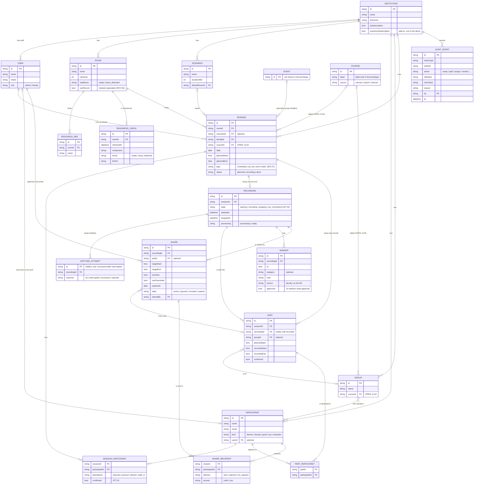

# Data model (prototype)

> **This is the information model behind the prototype's screens and demo data. It is not a database schema.** Engineering owns the production data model and is free to change it. The PRD v0.2 information model is the source. Where the prototype makes a working decision, it's marked as one.

Status: draft 0.1, 2026-10-01.

## Diagram

## Working decisions in the prototype

Each comes from the PRD's "working model decisions" unless marked otherwise.

1. **One session shows at most one recording.** Capture attempts and media files stay behind the scenes. The only visible trace is "recovered after interruption" in the history.
2. **Repeated groups are one session with sequential parts.** A part is a non-destructive time range, usually for one group. Planned parts exist before recording (DF-2, Session sheet); recording fills in their actual times. *Prototype decision:* a part belongs to the session and, once recorded, to the recording. Engineering still has to confirm whether downstream integrations need derived sessions (CAP-12).
3. **Attribution is two levels.** Who was booked or present in the session (`SESSION_PARTICIPANT`), and who is in each part (`PART_PARTICIPANT`). Both can be unconfirmed. Nothing blocks recording or debrief because of it.
4. **Participants don't need an account.** A learner who gets a share opens it with an email code or SSO (IAM-05).
5. **A share is a range, not a new file.** It points at a recording and a time range, optionally a part. It can be paused when a correction changes the range (SHR-10, DF-2 step 12).
6. **Every correction writes an audit event** with the old value, the new value, who, when and why.
7. **Events exist in the model but not in the UI.** A scheduled session is a session with a time.

## Open questions this model depends on

| Q | Question | Prototype default |
|---|---|---|
| Q-02 | Is **Course** a real entity, or a label? The PRD v0.2 has no Course entity. | Label only. Decide before the 10-15 handoff, because adding a core entity mid-build is expensive. |
| CAP-12 | Do downstream integrations need one session per group instead of parts? | One session with parts |
| — | Can a part have participants who are not in its group (walk-ins, swaps)? | Yes. Group is a default, `PART_PARTICIPANT` is the truth. |

## Not modelled in the prototype

Evaluation results, media assets, the inventory module, rotations and stations, scenario authoring. They are in the PRD and out of scope for 10-15.

## Demo data coverage (`data/seed.json`)

| Entity | In seed.json now | Needed by |
|---|---|---|
| Institution, users, rooms, resources, scenarios, groups, sessions | ✅ | all flows |
| Course | ✅ as a label | Q-02 |
| Participant | ⚠️ only as names inside groups | DF-1, DF-2, DF-3 (attribution, shares) |
| Session participants and parts | ❌ | DF-2 (planned parts A/B/C, swap, absent) |
| Recording | ❌ | DF-1, DF-2, DF-3 |
| Marker | ❌ | DF-1, DF-3 |
| Share and recipients | ❌ | DF-2 step 12, DF-3 |
| Readiness checks | ⚠️ only the room's last-check time | Rooms overview, room detail |
| Audit events | ❌ | DF-2 history tab |
