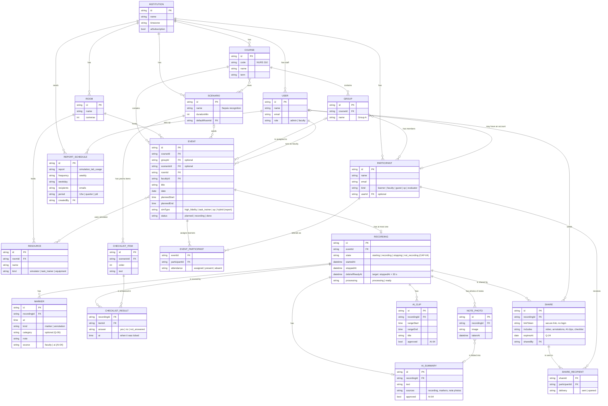

# Data model (prototype)

> **This is the information model behind the prototype's screens and demo data. It is not a database schema.** Engineering owns the production data model and is free to change it. The PRD v0.2 information model is the source. Where the prototype makes a working decision, it's marked as one.

Status: draft 0.2, 2026-10-05. Rebuilt for `flows/IMSH-demo-story-final.md`. Replaces draft 0.1 (2026-10-01, DF-1/2/3), which is in Git at the tag `spec-pre-imsh-final`.

## Diagram

## Working decisions in the prototype

1. **An event is the sim occurrence (Q-26, decided 2026-10-05).** There is no separate Session object: the PRD's *Session* is called **Event** in the model and in the UI. An event exists in the calendar before anyone records, and recording starts from it (flow step 4).
2. **A course is a container (Q-02, decided 2026-10-05).** It holds the groups and events, and uses scenarios. This is Gabor's concept. The demo shows it lightly: "NURS 310" on the event and its Group A. Course creation and editing stay out of scope; the course is pre-populated.
3. **Learners are assigned to the event, not to rotations (Q-27, decided 2026-10-05).** Rotations are dropped. On Edit event, assigning Group A fills `EVENT_PARTICIPANT` with its members. Unticking an absent learner on sim day sets `attendance` to `absent`. Nothing blocks recording because of attendance.
4. **One event has at most one recording.** Capture attempts and media files stay behind the scenes.
5. **The checklist belongs to the scenario, the answers belong to the recording.** Yes/no only, no score. Answers are ticked live in the recording view and shown in the debrief.
6. **Markers and annotations are one entity** with a `kind`, both pinned to a time in the recording.
7. **AI output is stored per recording and is reviewable (AI-04).** The summary takes the note photos as an input (flow step 9).
8. **A share is a link, not a new file.** It points at the recording and lists what's included. Recipients open it in the browser without logging in. The recipient page is out of scope.
9. **The usage report is derived, not stored.** Simulation hours, students in simulation, room usage and contact hours come from events, attendance and recordings. Simulator usage comes from `EVENT ↔ RESOURCE`, and session types come from `EVENT.simType`. Only the weekly schedule is stored (`REPORT_SCHEDULE`).

## Open questions this model depends on

| Q | Question | Prototype default |
|---|---|---|
| Q-10 | What does "ready in 30 s" mean: debrief material, or playable video? | `debriefReadyAt` marks debrief material. Video shows progress. |
| Q-23 | Contact-hour unit | 0.25 h per learner per event |
| Q-28 | AI-04 says AI output never reaches a learner without faculty approval. Does tapping **Share with participants** count as approving the AI summary and clips it includes? | Yes: the share sheet lists the AI items and Share approves them |
| — | Event `simType` values | High-fidelity · Task trainer · SP · Hybrid, to be checked against Gabor's *Reports* screen |

## Removed since draft 0.1

These are still the PRD's long-term target, but the IMSH flow doesn't use them: **Session** (merged into Event), **Part** and part attribution (fixing parts is out), **Capture attempt**, **Readiness check** (the rooms and readiness screens are out), **Audit event** (there's no history tab), the **ad hoc** session type, and the share's pause/revoke/download rights and code/SSO access.

## Not modelled in the prototype

Scoring and rubrics, learner performance, media assets, the inventory module, rotations and stations, scenario and checklist authoring, recording the debrief, and the room display layout (that's UI state on the tablet, not data).

## Demo data coverage (`data/seed.json` v0.2)

Planning day is Tue 2027-01-12 (steps 1–3), sim day is Tue 2027-01-19 (steps 4–12). Values that the flow creates are marked `createdInFlow` with the step number.

| Entity | In seed.json | Flow step |
|---|---|---|
| Institution, users, rooms | ✅ (readiness fields removed) | all |
| Resources | ✅ with `kind`: four simulators, one task trainer | 11 |
| Courses (container) | ✅ NURS 310 and NURS 340, with their groups and scenarios | 1–4 |
| Groups, participants | ✅ 4 groups, 19 learners with emails | 3, 4, 10 |
| Scenarios and checklist items | ✅ *Sepsis recognition* has 7 yes/no items | 5, 7 |
| Events and event participants | ✅ 6 events over the week. The demo event shows its learners at each stage: none yet, `afterStep3` (Group A assigned) and `afterStep4` (Olivia Grant absent) | 1–4, 11 |
| Recordings | ✅ the demo recording plus two past ones for *recent recordings* | 1, 5–7 |
| Markers and annotations, checklist results | ✅ on the demo recording | 5, 7 |
| AI summary (before and after the note photo), AI clips, note photo | ✅ (the photo image is a placeholder, not created yet) | 7, 9 |
| Share and recipients | ✅ four present learners | 10 |
| Simulation Lab Usage figures | ✅ 12 weeks, all six metrics plus a weekly trend | 11 |
| Report schedule | ✅ weekly, Monday 08:00, to Dana and the dean | 12 |
